# Atari Jaguar 240p Test Suite

[](https://github.com/JoeMatt/atari_jaguar_240p_test_suite/actions/workflows/build.yml)
[](https://github.com/JoeMatt/atari_jaguar_240p_test_suite/actions/workflows/release.yml)
[](https://github.com/JoeMatt/atari_jaguar_240p_test_suite/actions/workflows/sdk-image.yml)
[](https://github.com/JoeMatt/atari_jaguar_240p_test_suite/releases/latest)
[](#license)
[](https://github.com/JoeMatt/atari_jaguar_240p_test_suite/pkgs/container/jaguar-sdk)
[](https://en.wikipedia.org/wiki/Atari_Jaguar)

A bare-metal port of [Artemio Urbina's 240p Test Suite](https://github.com/ArtemioUrbina/240pTestSuite) to the Atari Jaguar — calibration patterns, lag tests, scroll tests, audio sweeps, and hardware probes for CRT/HDTV/upscaler evaluation, all running in ~1 MiB of cart ROM with no external dependencies.

> **Status**: Active fork of [BitJag/atari_jaguar_240p_test_suite](https://github.com/BitJag/atari_jaguar_240p_test_suite). Most BitJag open issues are now shipped (#1 MDFourier, #2 Resolution Switching, #3 IRE docs, #7 Rotary Controller, #8 Jaguar CD probe, #13 typos). The suite is feature-complete enough for everyday calibration use; we tag `v0.x` releases until full parity with the Genesis/SNES/Wii ports is reached.

## Download

Pre-built ROMs (`.cof`, `.bin`, `.rom`, `.j64` — release + debug flavours) are attached to every [GitHub release](https://github.com/JoeMatt/atari_jaguar_240p_test_suite/releases). Verify against `SHA256SUMS.txt` in the same release.

A community build is also hosted at [jagcorner.com/240p-test-suite](https://jagcorner.com/240p-test-suite/).

## Table of contents

- [Download](#download)
- [Introduction](#introduction)
- [What's included](#whats-included)
- [Controls](#controls)
- [Compiling & running](#compiling--running)
  - [Quick start (Docker)](#quick-start-container-recommended)
  - [Native install](#native-install)
  - [Build flavours](#build-flavours)
  - [Running the ROM](#running-the-rom)
  - [Smoke-testing against a libretro core](#smoke-testing-against-a-libretro-core)
  - [Discoverability & shell completion](#discoverability--shell-completion)
  - [Continuous integration & releases](#continuous-integration--releases)
- [Contributors](#contributors)
- [License](#license)

## Introduction

_As described on https://github.com/ArtemioUrbina/240pTestSuite_

The 240p test suite is a homebrew software suite for video game consoles developed to help in the evaluation of upscalers, upscan converters and line doublers.

It has tests designed with the processing of 240p signals in mind, although when possible it includes other video modes and specific tests for them. These have been tested with video processors on real hardware and a variety of displays, including CRTs and Arcade monitors via RGB.

As a secondary target, the suite aims to provide tools for calibrating colors, black and white levels for specific console outputs and setups.

This is free software, with full source code available under the GPL.

Learn more about the 240p Test Suite by Artemio at http://junkerhq.net/240p/

## What's included

Tests are grouped into five top-level menus. Items in **bold** were added or substantially rewritten in this fork.

| Menu | Tests |
| --- | --- |
| **Test Patterns** | Pluge · Color Bars · EBU Color Bars · SMPTE Color Bars · Referenced Color Bars · Color Bleed Check · Monoscope · Grid · Gray Ramp · White & RGB Screens · 100 IRE · Sharpness · Overscan · Convergence · **More Patterns →** (**Color Bars w/ Gray** · **Linearity** · **Phase** · **Brightness** · **Contrast** · **Y/C Delay** · **Diagonal**) |
| **Video Tests** | Drop Shadow · **Striped Sprite** · Lag Test · **Manual Lag Test** · Timing & Reflex · Scroll · **Vertical Scroll** · Grid Scroll · Horiz/Vert Stripes · Checkerboard · Backlight Zone · **Alternate 240p/480i** |
| **Audio Tests** | Sound Test · Audio Sync · **L/R Balance + 1 kHz Tone** · **MDFourier Sweep** |
| **Hardware Tools** | Controller Test · **Pro Controller Test** · **Rotary Controller Test** · GPU Memory Viewer · DSP Memory Viewer · DRAM Memory Viewer · **System Info** · **Jaguar CD Probe** · **Video Mode Test** (Resolution Switching) |
| **Screen Savers** | **Color Cycle** · **Bouncing Square** · **Scrolling Bars** |

In-app **Help** screens (per menu and per test) document the purpose, expected output, and any test-specific button bindings.

## Screenshots

Captured automatically by `scripts/screenshot-tour.py` driving the [virtualjaguar libretro core](https://github.com/libretro/virtualjaguar-libretro) through every top-level menu. Regenerate with `make screenshots && make screenshots-readme` (requires the local libretro core .dylib — see [Smoke-testing against a libretro core](#smoke-testing-against-a-libretro-core)). The block below is auto-rewritten between the markers.

Prefer browsing locally? Open [`screenshots/index.html`](screenshots/index.html) for a self-contained viewer (sticky group nav, click-to-zoom, no JS framework). Regenerate it standalone with `make screenshots-html`.

<!-- screenshots:start -->

_11 captures across 10 screens. Generated by `make screenshots && make screenshots-readme`._

<details><summary><strong>Main menu</strong> (1 shot)</summary>

<p>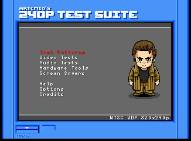<br><sub>Top-level menu (8 entries)</sub></p>

</details>

<details><summary><strong>Test patterns</strong> (2 shots)</summary>

<p>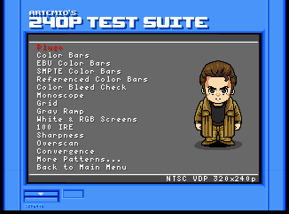<br><sub>Test Patterns sub-menu</sub></p>
<p>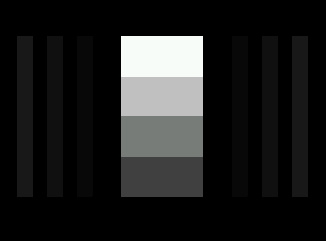<br><sub>Pluge (first pattern)</sub></p>

</details>

<details><summary><strong>Video tests</strong> (1 shot)</summary>

<p>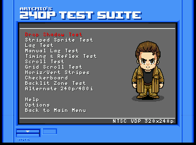<br><sub>Video Tests sub-menu</sub></p>

</details>

<details><summary><strong>Audio tests</strong> (1 shot)</summary>

<p>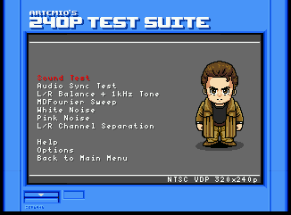<br><sub>Audio Tests sub-menu</sub></p>

</details>

<details><summary><strong>Hardware tools</strong> (1 shot)</summary>

<p>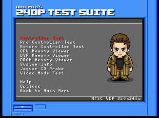<br><sub>Hardware Tools sub-menu</sub></p>

</details>

<details><summary><strong>EEPROM test</strong> (1 shot)</summary>

<p>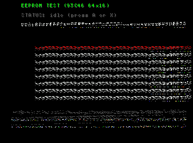<br><sub>EEPROM Test grid (64 words, hex)</sub></p>

</details>

<details><summary><strong>Screen savers</strong> (1 shot)</summary>

<p>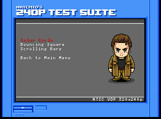<br><sub>Screen Savers sub-menu</sub></p>

</details>

<details><summary><strong>Help</strong> (1 shot)</summary>

<p>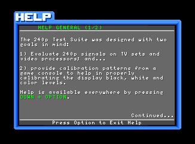<br><sub>Help screen</sub></p>

</details>

<details><summary><strong>Options</strong> (1 shot)</summary>

<p>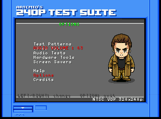<br><sub>Options screen</sub></p>

</details>

<details><summary><strong>Credits</strong> (1 shot)</summary>

<p>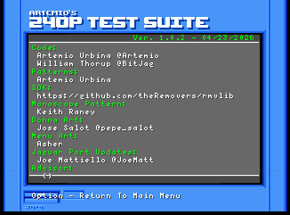<br><sub>Credits</sub></p>

</details>

<!-- screenshots:end -->

## Controls

Standard Jaguar pad bindings throughout the suite:

| Button | In menus | In tests (general) |
| --- | --- | --- |
| **D-Pad** | Move highlight | Test-specific (cycle pattern, move sprite, etc.) |
| **A** | Select / confirm | Test-specific (toggle, reset counter, etc.) |
| **B** | Back to previous menu | Test-specific |
| **C** | — | Test-specific |
| **Option** | Open Options menu | **Exit** test → previous menu |
| **Pause** | — | Pause/resume animation where supported |
| **\*** / **#** | — | Numeric keypad — used by some tests for fine adjustments |

**Exit pattern**: most tests exit with **Option**. The Controller / Pro Controller / Rotary tests use **LEFT + Option** so the exit chord can't collide with whatever button is being tested.

For test-specific bindings, open the in-app **Help** screen on each menu — they're authoritative and stay in sync with the code.

## Compiling & Running

There are two supported ways to build the ROM. The Docker path is recommended -- it works identically on macOS, Linux, and CI, and bakes in the entire Jaguar toolchain (crossmint, RMAC/RLN, rmvlib + jlibc). The fastboot cart header is generated by the bundled `scripts/make-rom.py`, a pure-Python port of Tursilion's `makefastboot` that needs no native binary.

### Quick start (container, recommended)

Any Docker-compatible runtime works:

- [Docker Desktop](https://docs.docker.com/get-docker/) (macOS / Windows / Linux)
- [Colima](https://github.com/abiosoft/colima) (free Docker Desktop replacement on macOS / Linux) -- auto-started on demand
- Docker Engine on Linux

```bash
make sdk-pull           # pulls ghcr.io/<owner>/jaguar-sdk:latest
make docker-build       # release .cof + .bin + .rom + .j64
make docker-rom         # release .rom (with universal cart header)
make docker-j64         # release .rom + .j64 (.j64 = same bytes, different ext)
make docker-debug       # debug   .cof + .bin + .rom + .j64 (-debug suffix, -O0 -g)
make docker-rom-debug   # debug   .rom
make docker-j64-debug   # debug   .rom + .j64
make docker-all         # both flavours, all artefacts, in one container invocation
make sdk-shell          # interactive shell in the SDK container
```

Every `docker-*` / `sdk-*` target depends on a `docker-up` order-only prereq that runs `docker info` first. If the daemon isn't reachable but `colima` is installed, it transparently runs `colima start` with the `COLIMA_*` tunables (see `make help`). On Apple Silicon, set `COLIMA_VM_TYPE=vz` once for fast amd64 builds via Rosetta:

```bash
brew install colima docker
make COLIMA_VM_TYPE=vz colima-start    # one-time
make docker-rom                         # auto-starts colima if it stops
```

If the prebuilt image isn't published yet (or you're hacking on it), build it locally:

```bash
make sdk-build          # builds docker/Dockerfile -> ghcr.io/<owner>/jaguar-sdk:latest
```

The `SDK_OWNER` / `SDK_IMAGE` Make variables let forks point at their own image:

```bash
make SDK_IMAGE=ghcr.io/myname/jaguar-sdk:dev sdk-pull docker-build
```

### Native install

For developers who'd rather not use Docker, the toolchain consists of:

- **m68k-atari-mint cross-tools** (cross compiler) - https://tho-otto.de/crossmint.php
- **RMAC** assembler - http://rmac.is-slick.com/ (installed as `mac` in `$JAGPATH/bin`)
- **RLN** linker - http://rmac.is-slick.com/ (installed as `aln` in `$JAGPATH/bin`)
- **Removers Library** (rmvlib + jlibc) - https://github.com/theRemovers/rmvlib
- **Ray's lz77 Packer** (optional, only if you modify graphics) - http://s390174849.online.de/ray.tscc.de/files/lz77_v13.zip
- **JCP** (optional, for flashing a Skunkboard) - http://harmlesslion.com/software/skunkboard
- **Python 3** (for the bundled `scripts/make-rom.py`, used by `make rom` to wrap the .bin in a fastboot cart header)

On Ubuntu the easiest path is the BitJag install scripts: https://github.com/BitJag/ubuntu-rmvlib-install-scripts

Once installed, set `JAGPATH` to the SDK root and build natively:

```bash
export JAGPATH=$HOME/Jaguar
make native-build              # clean + release all formats
make DEBUG=1                   # debug build
```

### Build flavours

| Variable      | Result                                                     | Output names                |
| ------------- | ---------------------------------------------------------- | --------------------------- |
| `DEBUG=0`     | `-O2 -fomit-frame-pointer -funroll-loops -DNDEBUG` (default) | `jag_240p_test_suite.{cof,bin,rom,j64}` |
| `DEBUG=1`     | `-O0 -g -DDEBUG`, `mac -d` for assembler symbols           | `jag_240p_test_suite-debug.{cof,bin,rom,j64}` |

Always `make clean` between switching flavours -- object files are not suffixed.

### Running the ROM

The `.rom` file works on real hardware, BigPEmu, Virtual Jaguar, Skunkboard, etc. The `.cof` file runs from RAM (via Alpine, Skunkboard `make skunkram`, `make vjram`) but some tests unpack assets larger than free RAM and will crash; prefer the `.rom`.

`.rom` and `.j64` are **byte-identical** -- the `.j64` extension exists purely because some emulator front-ends filter the file picker by extension. `make j64` (or `make docker-j64`) builds both; `make vjj64` launches the `.j64` in Virtual Jaguar.

ROM output is padded with trailing `0xFF` to the next 1 MiB boundary. This is required for Virtual Jaguar/libretro's cart-file type detection (non-padded images can "load" but never execute, usually showing a cyan top line + black screen).

> **RetroArch users:** the Virtual Jaguar libretro core (`virtualjaguar_libretro.{dylib,so,dll}`) accepts only `j64|jag|cue|cdi|iso` -- so you must load the **`.j64`**, never the `.rom` (which the core's extension filter rejects with `Content extension 'rom' is not supported`).

#### Smoke-testing against a libretro core

This codebase has no host-runnable unit tests by design — it's bare-metal Jaguar M68K with hardware register pokes, and the "tests" the project provides are the on-screen patterns the ROM itself draws. What we *can* automate is a boot smoke test: load the built ROM into a Jaguar libretro core and assert it runs N frames without crashing.

```bash
make doctor               # one-shot toolchain status (cc / SDK / docker / mame / libretro / BIOS)
make test                 # verify-sig + boot in libretro core for 60 frames (default)
make test TEST_FRAMES=300 # tweak frame count
make test-core            # build virtualjaguar_libretro.* from ../virtualjaguar-libretro
                          # (interactive: prompts to clone the repo if missing; CI errors clearly)
make test-mame            # local-only: boot .j64 in MAME's jaguar driver for 5 seconds (needs BIOS, see below)
make test-deps            # show resolved test variables (debug)
```

> **`make test-mame`** is a second-emulator smoke test using MAME's `jaguar` driver. MAME has a very different bug profile from Virtual Jaguar, so a clean boot in both is meaningfully stronger evidence than either alone. It's local-only because MAME's driver hard-requires `jagboot.rom` + `jagwave.rom` (copyrighted Atari BIOS, not redistributable, no `-bios skip` flag in this driver). Drop them under your MAME hash dir (`~/Documents/MAME/roms/jaguar/` on macOS, `~/.mame/roms/jaguar/` on Linux) and `make doctor` will surface them as `[ OK ]`. CI doesn't have the BIOS so there's no `mame-smoke` workflow.

`make test` is the recommended one-command "did I break boot?" check. It runs the fastboot-signature regression test (`scripts/verify-sig.py`) and then boots the ROM in your local libretro core. CI runs the same flow on every push (see `.github/workflows/build.yml` `smoke-test` job, which builds the core from `libretro/virtualjaguar-libretro@master` and uploads the final-frame screenshot as a downloadable artifact).

If you don't have a libretro core handy:

- Run `make test-core` to build one from a sibling checkout of `libretro/virtualjaguar-libretro` (clone it as `../virtualjaguar-libretro` first, or override `VJ_CORE_SRC=/path/to/checkout`).
- Or drop a prebuilt `virtualjaguar_libretro.{dylib,so,dll}` next to the Makefile manually.

The lower-level targets are still available for finer control:

```bash
make run                  # build .j64 and do a deterministic headless smoke run
make run-ui               # attempt UI launch (RetroArch; may crash on broken setups)
make libretro-run         # build, init core, load_game on $(OUT_PROJECT).jag (the .cof renamed),
                          # run 0 frames -- proves the core's content filter accepts the cart.
                          # Override with LIBRETRO_CONTENT=$(OUT_PROJECT).j64 to test the cart-image
                          # path instead (currently fails to boot without a real BIOS, see notes below).
make libretro-test        # init core + load_game (use LIBRETRO_FRAMES=N for frames)
make libretro-frames      # render 180 frames and dump every 30th to ./frames/*.png
```

The first invocation auto-creates `.venv-libretro/` and `pip install`s [JesseTG/libretro.py](https://github.com/JesseTG/libretro.py) into it; subsequent runs reuse it. The core is not committed to the repo (it's in `.gitignore`); grab the build that matches your platform from the [virtualjaguar_libretro releases](https://github.com/libretro/virtualjaguar-libretro) or RetroArch's online updater.

**What the smoke test actually proves**

- `load_game` returned `True` (the libretro core accepted the ROM header / size / extension filter).
- N `retro_run()` calls execute without raising or `_exit()`-ing.

**What it does NOT prove (intentional)**

- That the cart's menu is *visually* correct on a real Jaguar. The Virtual Jaguar BIOS animation requires a real Atari Jaguar BIOS ROM (copyrighted, not redistributable) to advance into cart code. Without a BIOS, the libretro framebuffer stays at the cyan-stripe init state for the entire run -- every captured frame is bit-identical regardless of frame count. The CI screenshot artifact (`smoke-test-frame-<sha>/frame-0000.png`) is therefore the *boot framebuffer*, not a render-regression baseline. If those init pixels ever change shape something fundamental broke (linker layout, fastboot signature, video init); otherwise the meaningful signal is in the log, not the image.

> **macOS caveat:** the Virtual Jaguar libretro core has an upstream bug where it calls `_exit(0)` from inside the first `retro_run()` invocation on macOS. The `libretro-load-test.py` harness treats `load_game returned True` in the log as success regardless of subsequent crashes, so `make test` still gives a meaningful signal — but the process exit code may misreport. CI runs on Linux where the bug doesn't apply.

If you'd rather wrap the `.bin` with a different tool, the original sources of the same fastboot algorithm are:

- [Jiffi](https://reboot.untergrund.net/new-reboot/jiffi.html) (Java)
- [makefastboot](https://github.com/tursilion/makefastboot/) (Windows-only C++)

### Discoverability & shell completion

Run `make help` for a categorised list of every target (native, docker, hardware helpers) and the variables that tweak them.

`make` itself auto-detects the environment so a bare `make` Just Works:

| Detected | What `make` does |
| --- | --- |
| Native `m68k-atari-mint-gcc` on PATH | runs the native build (`all`) |
| No native toolchain, but Docker on PATH | prints a notice and routes through `docker-build` |
| Neither toolchain nor Docker | prints a friendly help message and exits non-zero |

Tab completion of `make <TAB>` works two ways:

**1. Bundled, zero-config (recommended)** -- ships in this repo and bypasses every quirk of zsh/bash's stock `_make` (extended-glob requirements, stale `~/.zcompdump`, ifeq-block confusion, etc). It introspects the live makefile via `make -qpRr`, so it always matches what's actually invokable.

```bash
# zsh -- add to ~/.zshrc (or source ad-hoc):
source /path/to/atari_jaguar_240p_test_suite/scripts/completion.zsh

# bash -- add to ~/.bashrc (or source ad-hoc):
source /path/to/atari_jaguar_240p_test_suite/scripts/completion.bash
```

After that `make doc<TAB>` offers `docker-all docker-build docker-debug docker-j64 docker-j64-debug docker-rom docker-rom-debug docker-up`, `make col<TAB>` offers `colima-start colima-status colima-stop`, etc.

**2. Stock shell completion** -- works for most setups, no extra files to source:

```bash
# zsh -- compsys ships built-in completion for `make`:
autoload -Uz compinit && compinit

# bash -- install bash-completion (https://github.com/scop/bash-completion):
brew install bash-completion@2          # macOS
sudo apt install bash-completion        # Debian/Ubuntu
```

If `make <TAB>` shows files instead of targets after this, your `~/.zcompdump` is stale -- nuke and recompile:

```bash
rm -f ~/.zcompdump* && exec zsh
```

### Continuous integration & releases

This repo ships three GitHub Actions workflows:

- **`.github/workflows/sdk-image.yml`** -- rebuilds and publishes `ghcr.io/<owner>/jaguar-sdk:latest` whenever `docker/**` changes.
- **`.github/workflows/build.yml`** -- builds release + debug ROMs on every push and pull request, uploads them as run artifacts, and posts a sticky PR comment with the download links. Also exposes a `workflow_dispatch` trigger with a `flavours` choice (`both` / `release` / `debug`).
- **`.github/workflows/release.yml`** -- on `git push` of a `vX.Y.Z` tag (or via `workflow_dispatch`), builds release + debug, generates release notes, and attaches `.cof`, `.bin`, `.rom` (release + debug) plus `SHA256SUMS.txt` to a GitHub Release.

To cut a release:

```bash
git tag v1.2.3
git push origin v1.2.3
```

## Contributors

| Role | Credit |
| --- | --- |
| Original code | [Artemio Urbina](https://github.com/ArtemioUrbina) ([@Artemio](https://twitter.com/Artemio)) |
| Atari Jaguar port (original) | William Thorup ([@BitJag](https://github.com/BitJag)) |
| Atari Jaguar port (active fork) | Joe Mattiello ([@JoeMatt](https://github.com/JoeMatt)) |
| Patterns | Artemio Urbina |
| Monoscope pattern | Keith Raney |
| Donna art | Jose Salot ([@pepe_salot](https://twitter.com/pepe_salot)) |
| Main menu art | Asher |
| Extra patterns & collaboration | Konsolkongen & shmups regulars |
| SDK (rmvlib + jlibc) | [theRemovers](https://github.com/theRemovers/rmvlib) |
| Cart-header tooling | Adapted from Tursilion's [makefastboot](https://github.com/tursilion/makefastboot/) and [Jiffi](https://reboot.untergrund.net/new-reboot/jiffi.html) |

## License

**SPDX-License-Identifier:** [`GPL-2.0-or-later`](https://spdx.org/licenses/GPL-2.0-or-later.html)

Copyright © 2011–2022 Artemio Urbina  
Atari Jaguar port © 2022 William Thorup (BitJag)  
Atari Jaguar fork updates © 2024–2026 Joe Mattiello

This program is free software; you can redistribute it and/or modify it under the terms of the GNU General Public License as published by the Free Software Foundation; **either version 2 of the License, or (at your option) any later version** — the standard GPL "v2-or-later" grant inherited from the upstream Artemio / BitJag releases. The [`LICENSE`](LICENSE) file ships the full text of GPL v2 (the version-floor); the "or later" clause is granted here in this README and in the per-file headers, matching the original BitJag distribution.

This program is distributed in the hope that it will be useful, but **WITHOUT ANY WARRANTY**; without even the implied warranty of MERCHANTABILITY or FITNESS FOR A PARTICULAR PURPOSE. See the GNU General Public License for more details.

> **Why both "v2" and "v2-or-later"?** GitHub's licence detector keys off the verbatim text in [`LICENSE`](LICENSE) and reports `GPL-2.0` (it has no `GPL-2.0-or-later` heuristic — see [licensee/licensee#444](https://github.com/licensee/licensee/issues/444)). The actual *grant* is "v2 or later" per the source-header notices and the upstream BitJag README. The `GPL v2+` shield above and the SPDX id at the top of this section are the authoritative statement of intent.
